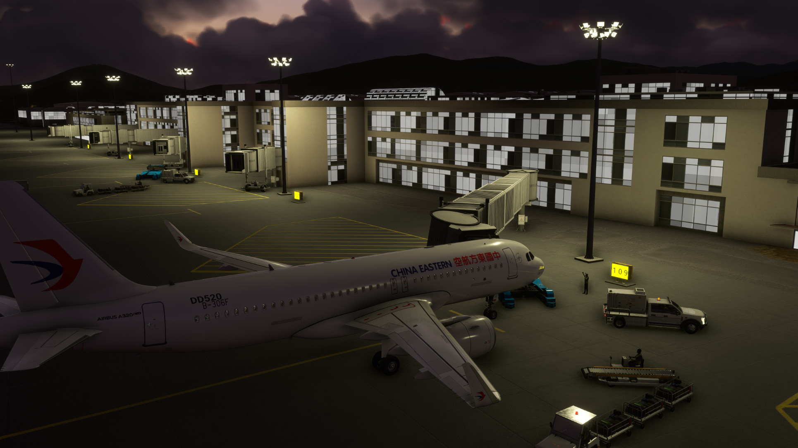

## FS2020 机场强化：三亚凤凰机场
### FS2020: Airport Enhancement for ZJSY

本项目基于官方机场进行若干优化：
* 开启滑行道灯
* 添加照明灯（停机位、登机口）
* 设置滑行道编号
* 添加滑行道指示牌
* 其他优化

This project makes several optimizations based on the stock airport of ZJSY:
* Turn on taxiway lights
* Add lights (parking bays, gates)
* Set the taxiway names
* Add taxiway signs
* Other optimizations

### 效果预览 Preview

